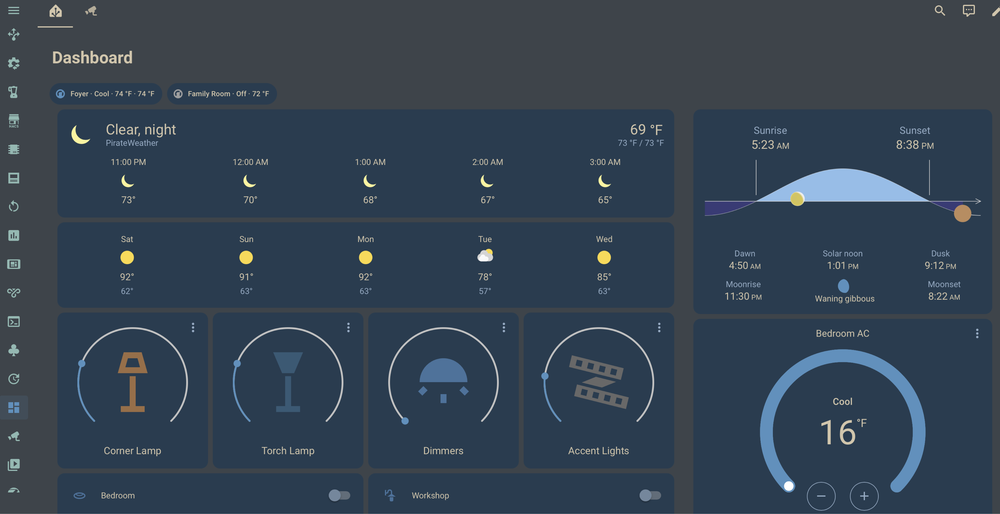
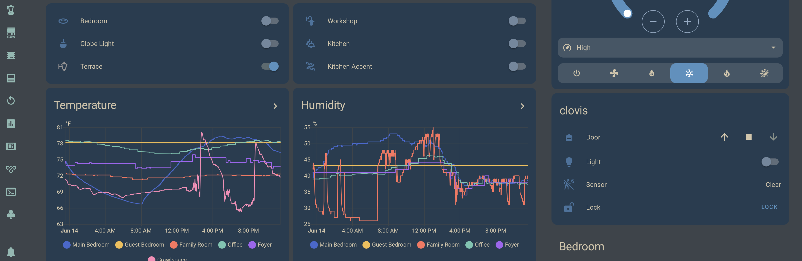
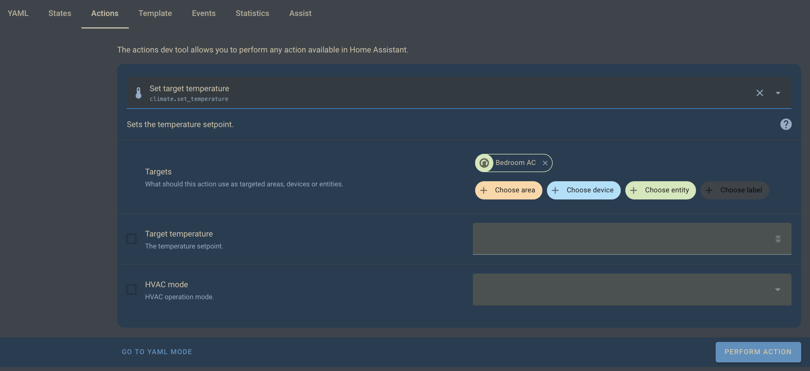
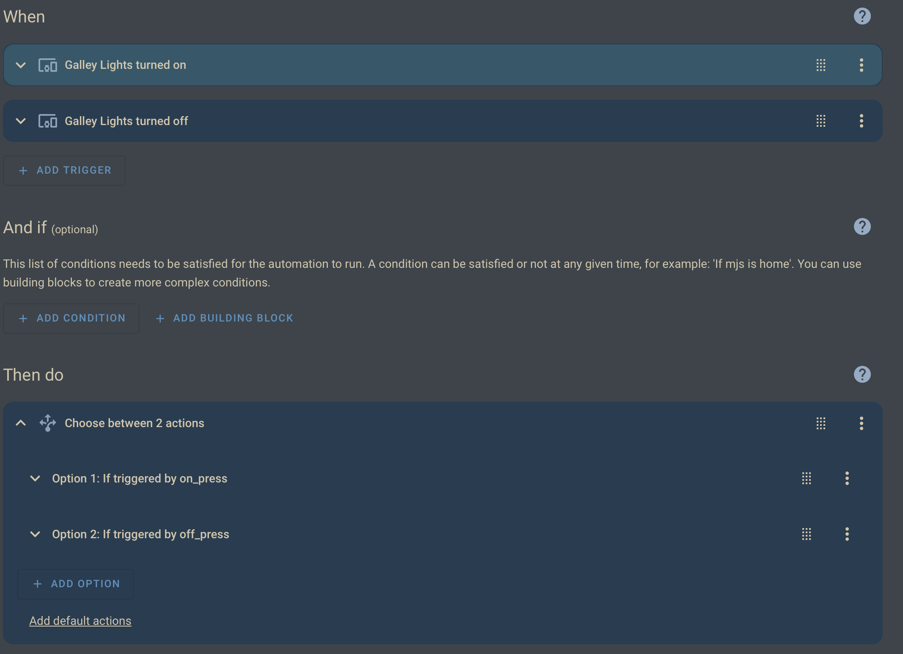

# ArcticForest Dark for Home Assistant

A cool-toned dark theme with pleasing contrast.

## Contents

- [About](#About)
- [Images](#Images)
- [Installation](#Installation)
  - [HACS Installation](#HACS-Installation-Recommended)
  - [Manual Installation](#Manual-Installation)
- [Additional Images](#Additional-Images)
- [License](#License)

## About

I started work on my collection of [***ArcticForest Dark***](https://github.com/mjs271/ArcticForest-Dark) themes when I stumbled upon [@sainnhe](https://github.com/sainnhe)'s [Everforest Dark theme](https://github.com/sainnhe/everforest-vscode) for [Obsidian](https://obsidian.md).
And, as someone who can't leave well-enough alone, I started tinkering with it...
As a recovering [Solarized Dark](https://ethanschoonover.com/solarized/) addict, I personally favor the cooler/bluer side of the spectrum.
Hence, we have ***ArcticForest Dark***.
After tweaking it for my daily-driver editors (Sublime Text, VS Code) and terminal (iTerm2), I decided it was time to give my off-hours obsession the same treatment...
And here we are with the official ***ArcticForest Dark for Home Assistant***.

I also want to give credit to aFFekopp's [Noctis](https://github.com/aFFekopp/noctis) theme that I ran for years and largely followed to build out this theme (sooooo many different colors to define!).

## Images

 | 
:-------------------------:|:-------------------------:
 | 

<!--  -->

<!--  -->

<!--  -->

<!--  -->

<!--  -->

## Installation

First, note that the instructions below may be specific to HassOS because that
is they way my Home Assistant instance is configured.
However, In the case of other installations, I suspect that these instructions
should at least get you to the general outcomes they are intended for.[^halp_plz]

[^halp_plz]: That said, if anyone with a different setup would like to add to
these instructions, please do and submit a PR!

### HACS Installation ***(Recommended)***

0. If HACS is not already installed, follow the [instructions](https://www.hacs.xyz/docs/use/#getting-started-with-hacs) from the
   HACS.xyz docs.

#### Once HACS is installed and configured...

- Navigate to HACS.
- Select the 3 dots in the top-right corner.
  - Choose ***Custom repositories***.
- Add the repository URL (`https://github.com/mjs271/ha_afdark`)
   to the ***Repository*** field.
- Choose `Theme` for the ***Type*** field.
- Click the ***Add*** button, and it should appear in the list above.
- Exit the popup dialog.
- Search for **ArcticForest Dark** and select it from the list.
- Choose ***Download*** at the bottom-right of the page.

#### Once the ArcticForest Dark theme is installed...

- Restart home-assistant.
  - At minimum, you must fully reload the yaml configuration at
    - ***Developer Tools*** > ***YAML*** > ***YAML configuration reloading***
      \> ***ALL YAML CONFIGURATION***.
  - I would recommend a full restart, though, to avoid any unexpected behavior.
    - ***Developer Tools*** > ***YAML*** > ***Check and restart***
      \> ***RESTART***.
- Enable the `arcticForest_dark` theme in your user profile.
  - ***Username in bottom-left corner*** > ***General (default first screen)***
    \> ***Browser settings*** > ***Theme***.

### Manual Installation

- Clone, download, or otherwise copy this repository to your Home Assistant
  instance.[^actually]
- Move or copy the `arcticForest_dark/` directory into the `themes/`
  subdirectory of the directory containing the top-level `configuration.yaml`
  for Home Assistant.
  - This is likely to be `$HA_ROOT/configuration/themes/`, where `HA_ROOT`
    represents the home directory of your admin user (probably `/root` in most
    cases).
  - If `themes/` does not exist here, create that directory.
  - ***Note:*** It is not explicitly required for your Home Assistant themes to
    be stored in `$HA_ROOT/configuration/themes/`, but it is convention and
    considered best practice.

So, to this point, altogether, we have

```shell
$ cd $HA_ROOT/configuration

# NOTE: the '-p' flag means that it won't error out if 'themes/' already exists
#       and also won't overwrite

$ mkdir -p themes/
$ cd themes/

# ==============================================================================
# clone the repository
# ==============================================================================

$ git clone https://github.com/mjs271/ha_afdark.git
$ cp ha_afdark/themes/ha_afdark.yaml .

# ==============================================================================
# *** OR ***
# ==============================================================================
# download the yaml configuration file directly
# ==============================================================================

# NOTE: the flag is a capital O ("oh"), and not a zero (0).

$ curl -O https://raw.githubusercontent.com/mjs271/ha_afdark/main/themes/arcticForest_dark.yaml

# ==============================================================================
```

#### Now, once you've done the above...

- Modify your top-level `configuration.yaml` to contain the following
  (presuming that the theme was intstalled to the location described above.)

```yaml
frontend:
  themes: !include_dir_merge_named themes
```

Finally, see the [instructions above](#Once-the-ArcticForest-Dark-theme-is-installed) to activate ArcticForest Dark.

[^actually]: Technically, Home Assistant only needs the
`arcticForest_dark.yaml` file within the `themes/` directory from this repo.

## Additional Images

 | 
:-------------------------:|:-------------------------:
 | 
 | 

<!--  -->

<!--  -->

<!--  -->
<!--  -->

<!--  -->
<!--  -->

<!--  -->
<!--  -->

<!--  -->
<!--  -->

## License

#### FIXME:

Link to repo, etc.

If you like it: use it, change it, improve it, but please attribute it.

For the record, if anyone wants to take on a light-themed version, I would consider that an honor and will shout it out, link to it everywhere, include it, or whatever else because I will probably never take the time to do so myself :slightly_smiling_face:

[ArcticForest Dark for Home Assistant](https://github.com/mjs271/ha_afdark) © 2025 by [mjs271](https://github.com/mjs271) is licensed under [CC BY-NC-SA 4.0](https://creativecommons.org/licenses/by-nc-sa/4.0/).

   
