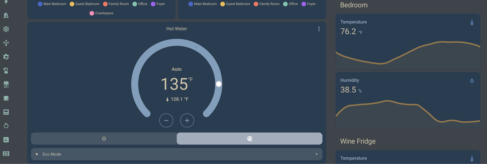
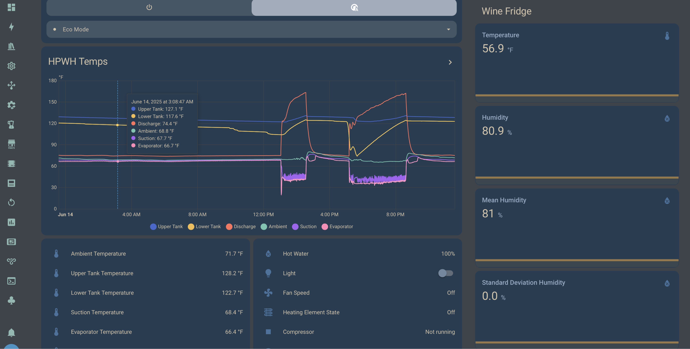

# ArcticForest Dark for Home Assistant

A cool-toned dark theme with pleasing contrast.

## About

I started work on my collection of [***ArcticForest Dark***](https://github.com/mjs271/ArcticForest-Dark) themes when I stumbled upon [@sainnhe](https://github.com/sainnhe)'s [Everforest Dark theme](https://github.com/sainnhe/everforest-vscode) for [Obsidian](https://obsidian.md).
And, as someone who can't leave well-enough alone, I started tinkering with it...
As a recovering [Solarized Dark](https://ethanschoonover.com/solarized/) addict, I personally favor the cooler/bluer side of the spectrum.
Hence, we have ***ArcticForest Dark***.
After tweaking it for my daily-driver editors (Sublime Text, VS Code) and terminal (iTerm2), I decided it was time to give my off-hours obsession the same treatment...
And here we are with the official ***ArcticForest Dark for Home Assistant***.

I also want to give credit to aFFekopp's [Noctis](https://github.com/aFFekopp/noctis) theme that I ran for years and largely followed to build out this theme (sooooo many different colors to define!).

## Images

FIXME: make these smaller

<!--  -->

<!--  -->

<!--  -->

<!--  -->

## License

#### FIXME:

Link to repo, etc.

If you like it: use it, change it, improve it, but please attribute it.

For the record, if anyone wants to take on a light-themed version, I would consider that an honor and will shout it out, link to it everywhere, include it, or whatever else because I will probably never take the time to do so myself :slightly_smiling_face:

[ArcticForest Dark for Home Assistant](https://github.com/mjs271/ha_afdark) © 2025 by [mjs271](https://github.com/mjs271) is licensed under [CC BY-NC-SA 4.0](https://creativecommons.org/licenses/by-nc-sa/4.0/).

   
